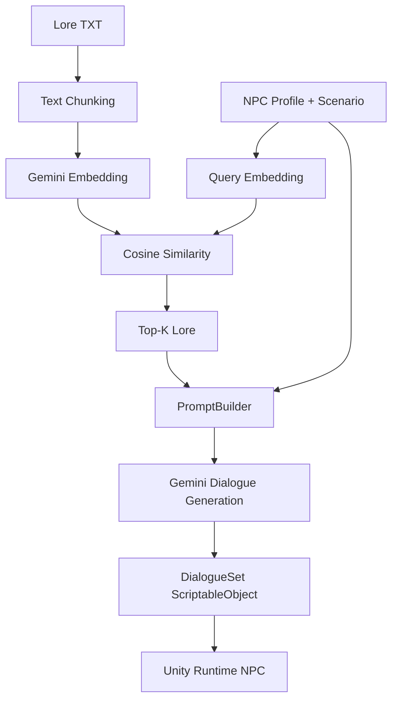

# RAG-powered NPC Dialogue Generation Plugin

## Overview

This Unity project demonstrates a lightweight RAG-powered NPC dialogue generation plugin inside an existing 2D platformer game. The base platformer project originated from an open-source Unity template; this repository's main contribution is the AI-assisted NPC dialogue authoring workflow, local lore retrieval, semantic RAG pipeline, and runtime dialogue display.

## Motivation

Normal LLM-generated NPC dialogue can sound fluent but hallucinate or contradict game lore. This project uses retrieval-augmented generation (RAG) to ground dialogue in local world-building documents before calling Gemini-compatible generation.

## Main Features

- Unity Editor NPC Dialogue Generator
- Persistent NPC profiles as ScriptableObjects
- Mock generation for offline testing
- Gemini / OpenAI-compatible dialogue generation
- Local lore documents in `.txt` format
- Text chunking
- Keyword retrieval
- Gemini embeddings
- Cosine similarity
- Top-K semantic retrieval
- DialogueSet ScriptableObjects
- Runtime NPC dialogue display

## Architecture



## RAG Modes

- **No RAG**: Uses only the NPC profile and scenario. This is the baseline.
- **Keyword RAG**: Retrieves lore chunks by overlapping words between the query and lore text.
- **Semantic RAG**: Converts lore chunks and the query into embeddings, compares them with cosine similarity, and uses the most relevant chunks.

## Semantic Retrieval

Semantic retrieval follows a simple pipeline:

`Embedding -> Vector -> Cosine Similarity -> Top-K`

An embedding represents text as numbers. Cosine similarity compares whether two vectors point in a similar direction. The Top-K chunks are inserted into the prompt as retrieved game lore.

## Demo

Primary scenario:

`Does Roland help the rebels at night?`

The relevant lore says Roland repairs equipment for resistance members after sunset. Keyword retrieval depends mostly on exact word overlap, while semantic retrieval can connect "rebels" with "resistance members" and "night" with "after sunset" without hardcoded synonym rules.

Second scenario:

`Player asks Roland what he thinks about magic.`

Relevant lore includes Roland's caution around strangers, his sympathy for the Mage Resistance, and Asteria's anti-magic laws.

## Project Structure

```text
Assets/RAGNPCDialogue/
  Editor/
    NPCDialogueGeneratorWindow.cs
    GeminiEmbeddingService.cs
    SemanticLoreRetriever.cs
    KeywordLoreRetriever.cs
    LoreDocumentLoader.cs
    TextChunker.cs
    PromptBuilder.cs
  Runtime/
    NPCProfile.cs
    NPCProfileAsset.cs
    DialogueSet.cs
    DialoguePresenter.cs
    DialogueTrigger2D.cs
  Lore/
    WorldHistory.txt
    Factions.txt
    Characters.txt
    Locations.txt
  Generated/
    DialogueSets/
    NPCProfiles/
Docs/
  InterviewArchitecture.md
  ResumeProjectSummary.md
```

## How to Run

1. Open the project in Unity.
2. Open `Tools -> AI Tools -> NPC Dialogue Generator`.
3. Configure Gemini / OpenAI-compatible API settings. The API key is saved in EditorPrefs, not source files.
4. Create or select an NPC profile asset.
5. Select retrieval mode: `None`, `Keyword`, or `Semantic`.
6. For Semantic mode, click `Build Semantic Index`.
7. Enter a scenario and click `Preview Retrieved Lore`.
8. Generate dialogue with Mock or Real API mode.
9. Save the result as a DialogueSet.
10. Enter Play Mode and interact with Roland.

## API Key Security

API keys are entered through the Unity Editor window and stored with Unity `EditorPrefs`, or read from environment variables. Keys are not stored in source code, scenes, prefabs, ScriptableObjects, or generated dialogue assets.

## Limitations

- Small local lore dataset.
- In-memory semantic index only.
- No persistent vector database.
- No conversation memory.
- No branching dialogue.
- Designed as a lightweight portfolio demo rather than a production dialogue platform.

## Future Improvements

- Larger lore datasets.
- Persistent vector index.
- Dialogue memory.
- Branching dialogue.

## Credits

The base 2D platformer game originated from the open-source project **2D-platformer-Game-Unity** by Hasan / `striderzz`, licensed under the MIT License. The original `LICENSE` file is preserved in this repository. The AI NPC dialogue generator, RAG retrieval pipeline, Gemini integration, and runtime dialogue plugin are the added contribution in this version.
